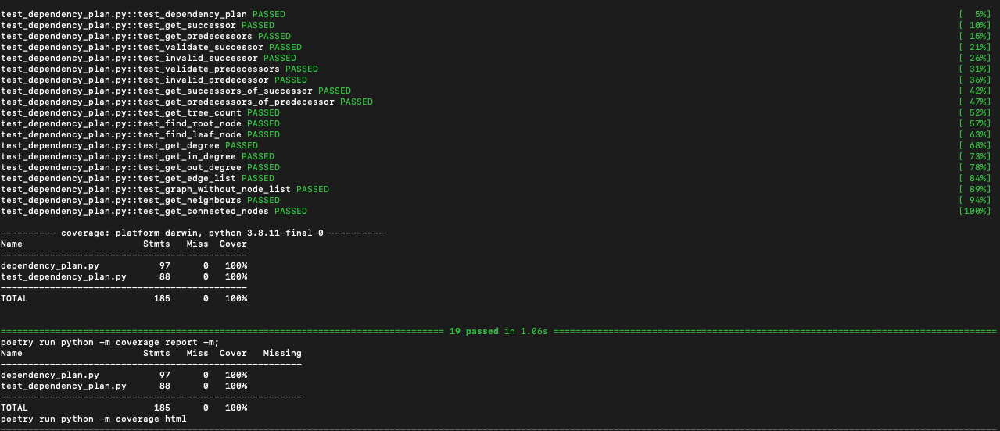

# execute-workflow-with-networkx

# Create and execute a workflow of tasks with networkx (Python)

## Summary:
The goal is to run a workflow created from a collection of steps (graph nodes) and their dependencies (graph edges).

create a `networkx.DiGraph()` and run a traversal that executes a callback on the different nodes?

## Example:

Please view the example graph:

## UnitTest:

